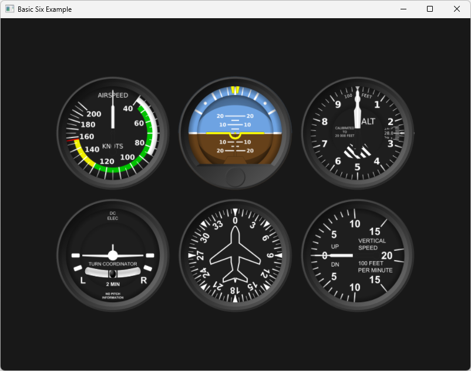
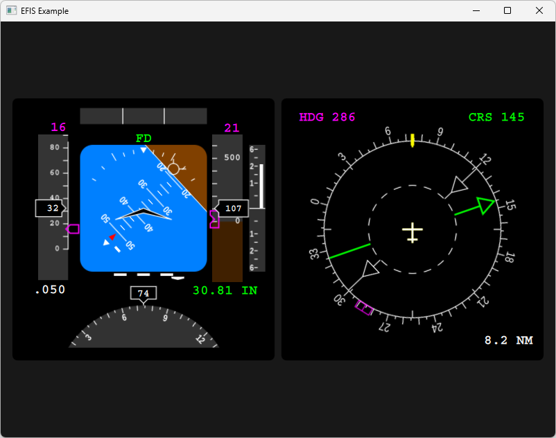
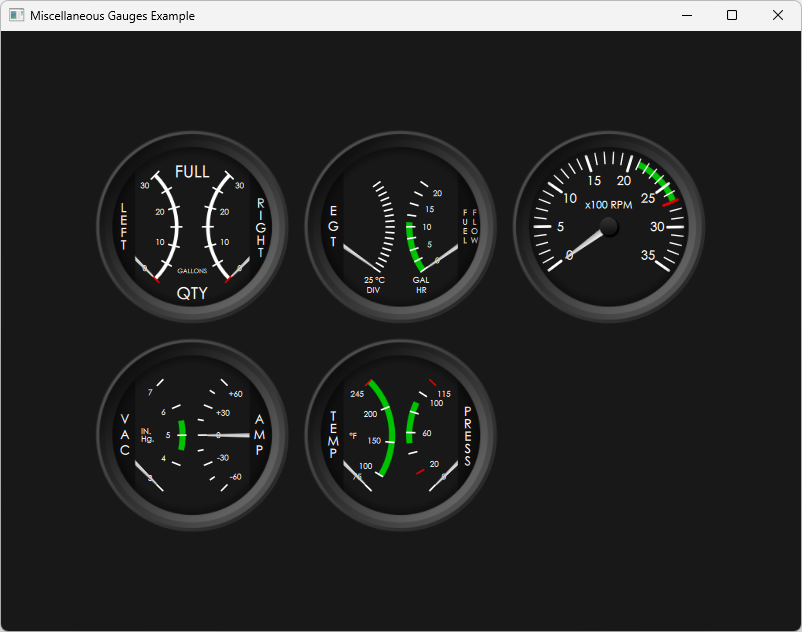

# QML Flight Instruments
`QML` port of [Marek M. Cel](http://marekcel.pl/)'s work [QFlightinstruments](https://github.com/marek-cel/QFlightinstruments).
I also implemented 6 miscellaneous gauges by using javascript and `Canvas` type of `QML`.

SVG files are taken from Marek's repository.
His copyright notice `LICENSE` is under `Data/Images` folder.
For the details, please visit Marek's repository.

## Build
1) Install `Qt 5.15.2`.
2) Open `QmlFlightInstruments.pro` with `QtCreator` and build & run it. 

## Screenshots
### Basic Six

### Electronic Flight Instrument System

### Miscellaneous

## Keywords
`QML`,
`GUI`,
`Flight Simulator`,
`Flight Instruments`,
`Airspeed Indicator`,
`ASI`, 
`Attitude Indicator`,
`AI`,
`Altimeter`,
`ALT`,
`Turn Coordinator`,
`TC`,
`Heading Indicator`,
`HI`,
`Vertical Speed Indicator`,
`VSI`,
`Electronic Attitude Direction Indicator`,
`EADI`,
`Electronic Horizontal Situation Indicator`,
`EHSI`.